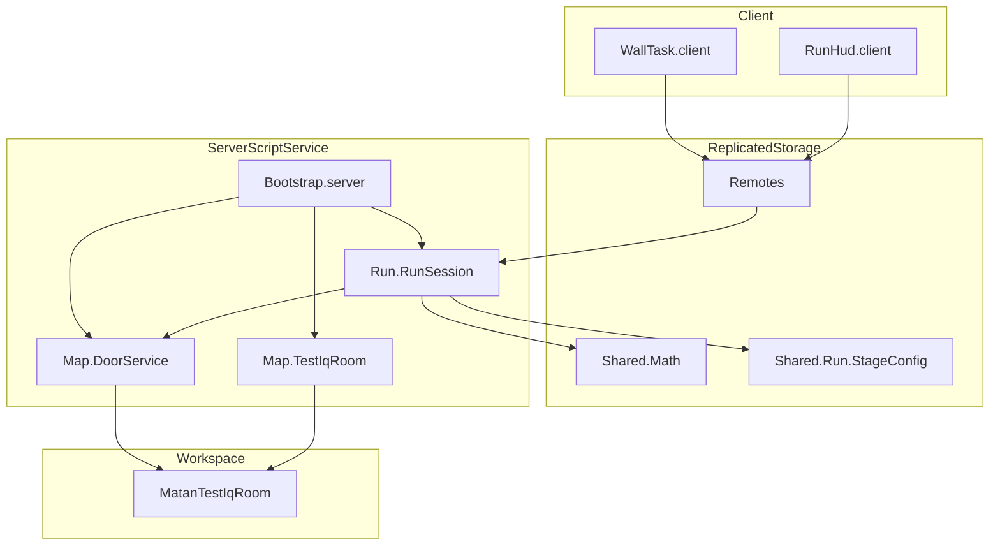

# Семантическая карта проекта **99rooms** (матан)

Документ описывает **смысловые области**, **границы ответственности** и **потоки данных** между частями кода. Пути — относительно корня репозитория.

---

## 1. Назначение продукта

Игровой **прогон из 99 «комнат»**: на каждом этапе игрок решает **задачу на дроби** (сложение/вычитание), выбирает ответ из **четырёх вариантов** или вводит строку (сервер поддерживает оба способа). После верного ответа **открывается дверь** в тестовой комнате; следующая задача снова запрашивается у «экрана» (разблокировка через `fromWall`).

---

## 2. Топология Rojo (где что живёт в DataModel)

Источник правды: `default.project.json`.

| Путь в репозитории | Roblox-контейнер |
|--------------------|------------------|
| `src/shared` | `ReplicatedStorage.Shared` |
| `src/server` | `ServerScriptService.Server` |
| `src/client` | `StarterPlayer.StarterPlayerScripts.Client` |
| `Remotes` (только в JSON) | `ReplicatedStorage.Remotes` |

**Удалённые вызовы:**

- `GetRunState` (RemoteFunction) — запрос состояния забега; второй аргумент `fromWall == true` снимает `taskLocked` и позволяет выдать задачу.
- `SubmitAnswer` (RemoteFunction) — отправка `{ problemToken, choiceIndex }` или `{ problemToken, answer }`.
- `OpenDoor` (RemoteEvent) — клиентский тумблер двери по проксимити (не путать с автоматическим открытием при верном ответе на сервере).

---

## 3. Домены и модули

### 3.1. **Забег / сессия** (сервер)

| Модуль | Роль |
|--------|------|
| `src/server/Run/RunSession.luau` | Единственный владелец **состояния игрока**: этап 1…99, RNG, текущая задача, токен, варианты, попытки (3), флаг блокировки до взаимодействия со стеной. Валидация ответа, переход этапа, вызов двери. |
| `src/server/Bootstrap.server.luau` | Точка входа сервера: сборка комнаты, привязка двери, регистрация обработчиков `GetRunState` / `SubmitAnswer`. |

**Смысловые типы:** `PublicState`, `SubmitResult` — контракт между сервером и клиентом (таблицы с полями `stage`, `prompt`, `choices`, `problemToken`, `attemptsLeft`, `ok`, `message`, …).

### 3.2. **Математика** (общая логика, реплицируемая концепция)

Пакет `ReplicatedStorage.Shared.Math` (`src/shared/Math/init.luau` агрегирует):

| Модуль | Роль |
|--------|------|
| `Fraction.luau` | Дроби: операции, представление для задач. |
| `ProblemGenerator.luau` | Генерация условия под параметры этапа. |
| `AnswerChecker.luau` | Проверка текстового ответа против канонической дроби. |
| `Choices.luau` | Сборка **четырёх** строк-вариантов и индекса правильного. |

**Конфиг этапов:** `src/shared/Run/StageConfig.luau` — `STAGE_COUNT = 99`, рост знаменателя с этапом, с какого этапа разрешены неправильные дроби, человекочитаемая метка комнаты. Связь: **номер комнаты → параметры сложности задачи**.

### 3.3. **Мир / геометрия** (сервер)

| Модуль | Роль |
|--------|------|
| `src/server/Map/TestIqRoom.luau` | Процедурная **тестовая комната** `Workspace.MatanTestIqRoom`: пол, стены, «экран», кнопки `TaskWallButton` / `DoorInteract`, часть `DoorPanel` с атрибутами шарнира. |
| `src/server/Map/DoorService.luau` | Привязка к модели: tween открытия/закрытия по шарниру; `open()` / `close()` для сценария «верный ответ»; серверный listener на `OpenDoor` для ручного переключения с проверкой дистанции. |
| `src/server/Map/CorridorMap.luau` | Альтернативная **карта коридора** (`MatanCorridor`); в текущем `Bootstrap` **не подключается** — запасной/будущий слой визуализации маршрута. |

### 3.4. **Интерфейс** (клиент)

| Скрипт | Роль |
|--------|------|
| `src/client/RunHud.client.luau` | Верхний **ScreenGui** «Матан — 99 комнат»: статус комнаты, подсказки, ожидание remotes; реакция на атрибут `MatanShowHudTask` для обновления после задачи. |
| `src/client/WallTask.client.luau` | Нижняя панель **четырёх кнопок** по проксимити «Показать задание»; `InvokeServer(true)` для разблокировки; `SubmitAnswer` по клику; синхронизация атрибута с HUD; опционально прокси на `OpenDoor` у двери. |

---

## 4. Ключевые потоки (семантика поведения)

### 4.1. Получить задачу

1. Игрок активирует стену → клиент вызывает `GetRunState(true)`.
2. Сервер в `RunSession.getState` при `fromWall` сбрасывает `taskLocked`.
3. `ensureProblem` создаёт задачу (этап 1 — фиксированное демо 1/2+1/3; далее — генератор + `Choices`).
4. Клиент рисует панель из `prompt`, `choices`, `problemToken`, `attemptsLeft`.

### 4.2. Ответить

1. Клиент шлёт `SubmitAnswer` с тем же `problemToken` и `choiceIndex` (или строкой `answer`).
2. При успехе: этап +1, задача очищена, `taskLocked = true`, **отложенно** `DoorService.open()`, через ~1.1 с `DoorService.close()`.
3. При ошибке: уменьшение попыток; при 0 — сброс задачи и снова нужна стена.

### 4.3. Ручная дверь

`OpenDoor:FireServer()` из клиента → `DoorService` переключает tween, если игрок в радиусе от `DoorPanel`.

---

## 5. Диаграмма зависимостей (высокий уровень)

---

## 6. Инварианты и краевые смыслы

- **Один источник истины по прогрессу** — таблица `sessions[player]` в `RunSession`; при выходе игрока сессия очищается.
- **`problemToken`** — защита от гонок и устаревших submit после смены задачи.
- **`taskLocked`** — задача не выдаётся «с воздуха», пока игрок не взаимодействует со стеной (кроме уже выданной активной задачи).
- **Демо-этап 1** захардкожен в `RunSession` отдельно от `ProblemGenerator` — осознанный педагогический/отладочный якорь.

---

## 7. Файловый указатель (быстрый поиск)

| Задача | Файл |
|--------|------|
| Поменять число комнат или сложность по этапу | `src/shared/Run/StageConfig.luau` |
| Изменить генерацию / проверку дробей | `src/shared/Math/*.luau` |
| Правила забега, попытки, дверь после ответа | `src/server/Run/RunSession.luau` |
| Подключить коридор вместо/вместе с IQ-комнатой | `src/server/Bootstrap.server.luau` + `Map/CorridorMap.luau` |
| UI стены и кнопки | `src/client/WallTask.client.luau` |
| Верхний HUD | `src/client/RunHud.client.luau` |
| Контракт сети | `default.project.json` + обработчики в `Bootstrap.server.luau` |

---

*Карта отражает состояние кодовой базы на момент генерации документа; при появлении новых систем имеет смысл обновить разделы 3 и 5.*
